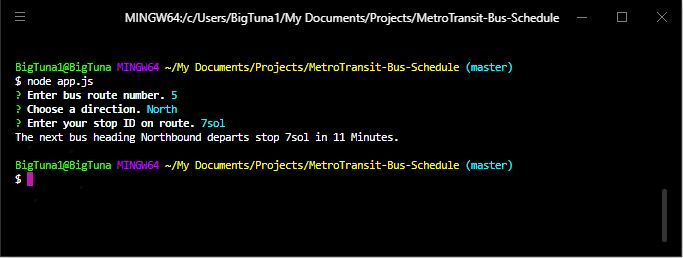

# MetroTransit-Bus-Schedule

Find out how many minutes until the next bus leaves your bus stop, by providing your Route Number, Direction and Stop Code.

A node.js CLI app that prompts for your route number, direction and bus stop code.

### Installation

- Clone Repo.
- Install node modules

```shell
npm install
```



### Technology

- [Node.js](https://nodejs.org/en/)
- [Axios](https://github.com/axios/axios)
- [Inquirer.js](https://github.com/SBoudrias/Inquirer.js)
